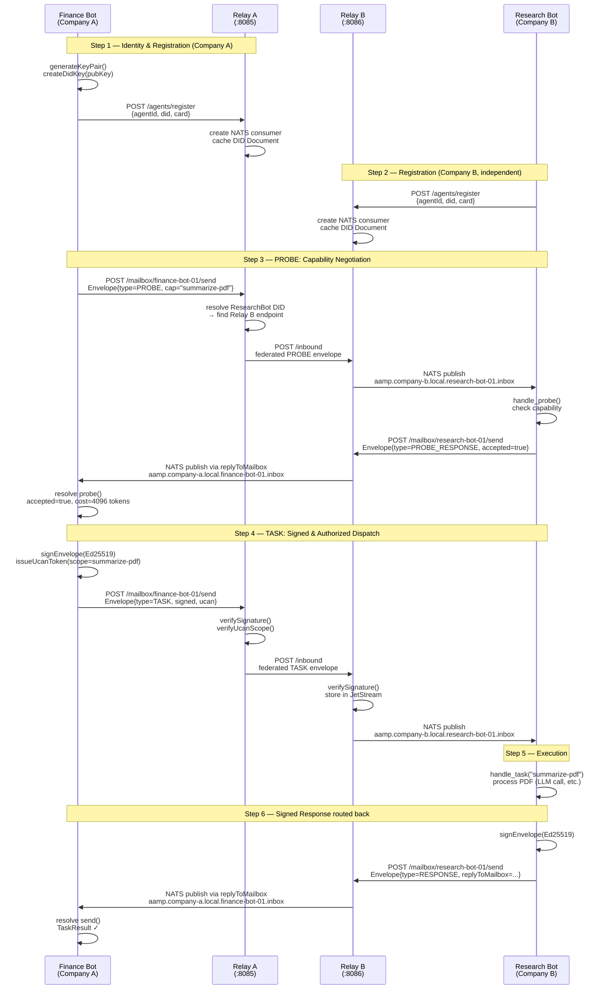

# AAMP — Agent-to-Agent Messaging Protocol

> **"Email for AI Agents"** — a federated, asynchronous, cryptographically-secure protocol for inter-agent communication across organizational boundaries.

[](specs/RFC-0001-AAMP.md)
[](specs/RFC-0001-AAMP.md)
[](#)

---

## Table of Contents

- [What is AAMP?](#what-is-aamp)
- [Why Not Existing Protocols?](#why-not-existing-protocols)
  - [vs. MCP (Model Context Protocol)](#vs-mcp-model-context-protocol)
  - [vs. Google A2A](#vs-google-a2a)
  - [vs. Raw HTTP / REST](#vs-raw-http--rest)
  - [vs. gRPC / WebSockets](#vs-grpc--websockets)
  - [Comparison Matrix](#comparison-matrix)
- [The SMTP Analogy](#the-smtp-analogy)
- [Architecture](#architecture)
  - [The "Mailbox" Pattern](#the-mailbox-pattern)
  - [Cross-Company Communication Flow](#cross-company-communication-flow)
  - [Protocol Layers](#protocol-layers)
- [Core Concepts](#core-concepts)
  - [Agent Identity (DIDs)](#agent-identity-dids)
  - [The Envelope](#the-envelope)
  - [Agent Card](#agent-card)
  - [Capability Tokens](#capability-tokens)
  - [Routing Modes](#routing-modes)
  - [Capability Negotiation (PROBE)](#capability-negotiation-probe)
- [Monorepo Structure](#monorepo-structure)
- [Quick Start](#quick-start)
  - [Running the Demo](#running-the-demo)
  - [TypeScript SDK](#typescript-sdk)
  - [Python SDK](#python-sdk)
- [Relay Server](#relay-server)
- [Security Model](#security-model)
- [Roadmap](#roadmap)
- [Contributing](#contributing)
- [References](#references)

---

## What is AAMP?

AAMP is a protocol for AI agents to send tasks to, receive results from, and collaborate with other AI agents — even when those agents are:

- **Built by different companies** with no pre-established relationship
- **Running in sandboxed environments** with no inbound ports
- **Using different LLM frameworks** (LangGraph, AutoGen, LlamaIndex, CrewAI...)
- **Offline** when a message is sent
- **Not trusted by default** (zero-trust model)

It does this by combining four proven technologies into a cohesive protocol stack:

| Component | Technology | Purpose |
|---|---|---|
| Identity | DIDs (W3C standard) | Every agent has a cryptographic, self-sovereign identity |
| Authorization | UCAN-inspired tokens | Scoped, delegatable capability grants |
| Message Bus | NATS JetStream | Durable, federated store-and-forward messaging |
| Discovery | Agent Cards + DID Docs | How agents find each other across organizations |

---

## Why Not Existing Protocols?

### vs. MCP (Model Context Protocol)

[MCP](https://modelcontextprotocol.io/) by Anthropic is excellent at what it does: connecting AI agents to **tools and data sources** (databases, APIs, file systems). It is deliberately agent-to-tool, not agent-to-agent.

| | MCP | AAMP |
|---|---|---|
| **Primary use case** | Agent ↔ Tool | Agent ↔ Agent |
| **Task duration** | Synchronous, short-lived | Async, long-running OK |
| **Agent identity** | None | DID (cryptographic) |
| **Cross-company** | No | Yes (federated) |
| **Trust model** | Implementation-defined | Zero-trust + UCAN tokens |
| **Authorization** | None built-in | Capability-scoped tokens |
| **Offline delivery** | No | Yes (store-and-forward) |
| **Task threading** | No | Yes (taskId chain) |
| **Inbound ports** | Required (SSE server) | Not required (agents connect out) |

**Where MCP shines:** `agent.tools.call("search", {...})` — invoking a local or remote tool.

**Where AAMP fills the gap:** When that "tool" is actually another autonomous AI agent at a different company that needs to run a long task in its own sandbox and return a result later.

> AAMP is designed to sit **above** MCP. An AAMP agent can use MCP tools internally; AAMP handles the inter-agent coordination layer.

---

### vs. Google A2A

[Google's A2A protocol](https://google.github.io/A2A/specification/) (released April 2025) is the closest existing standard to AAMP and was a direct inspiration. It correctly identifies the need for async task primitives and task lifecycle management.

| | Google A2A v0.1 | AAMP v0.1 |
|---|---|---|
| **Agent identity** | None (OAuth/HTTPS only) | DID (self-sovereign, cryptographic) |
| **Authorization** | OAuth 2.0 | UCAN (delegatable, scoped) |
| **Cross-domain auth** | Pre-established OAuth clients | Zero-trust via DID + UCAN |
| **Task discovery** | Agent Card (similar) | Agent Card + DID Document |
| **Capability negotiation** | No | PROBE/PROBE_RESPONSE |
| **Pre-task cost estimate** | No | Yes |
| **Delegation chains** | No | Yes (UCAN attenuation) |
| **Inbound ports needed** | Yes | No (outbound only) |
| **Message bus** | HTTP request-response | NATS JetStream |
| **Offline delivery** | Partial | Yes |
| **Routing modes** | None | 5 modes (IETF topologies) |
| **Human-in-loop** | Partial | First-class (`CONFIRM` type) |

**The critical difference:** A2A relies on OAuth 2.0 for authorization. This requires Company A to pre-register an OAuth client with Company B's authorization server — exactly the kind of bilateral relationship setup that doesn't scale to a world with thousands of AI agents across thousands of companies.

AAMP uses DIDs and UCAN tokens: Company A's agent can contact Company B's agent **without any prior registration**, just as your email server can send email to any other mail server in the world without a prior arrangement.

---

### vs. Raw HTTP / REST

Direct HTTP request-response is the most common ad-hoc approach for agent communication. It fails in several critical ways:

**The inbound port problem:**
```
                    HTTP POST
Company A Agent ─────────────────► Company B Agent
                                   (needs inbound port 443 in sandbox — usually blocked)
```

**The async problem:** Long-running tasks (summarizing a 200-page document, running a simulation, fetching live market data) cannot fit in a synchronous HTTP response. Webhooks require the sender to also be reachable — same inbound port problem.

**The trust problem:** How does Company B's agent know the HTTP call is genuinely from Company A and not a spoofed request? TLS only verifies the transport; it says nothing about the sending agent's identity or what it's authorized to do.

**The state problem:** If the network hiccups mid-task, there's no standard way to resume. The sending agent must re-implement retry logic, idempotency keys, and state recovery.

AAMP solves all of these with the relay pattern (no inbound ports), JetStream store-and-forward (offline resilience), DID signatures (verified identity), and UCAN tokens (proven authorization).

---

### vs. gRPC / WebSockets

gRPC and WebSockets solve the performance problem (binary, multiplexed, efficient) but amplify the architectural problems:

- Both require persistent, bidirectional connections — impossible between sandboxed agents behind NAT.
- Neither provides agent identity, authorization, or store-and-forward.
- Connection management overhead (reconnection, backpressure) becomes the developer's problem.

AAMP's NATS transport *uses* a persistent connection, but only from **agent outward to its own relay** — a simple client-to-server connection that works behind any firewall. The cross-company hop is plain HTTPS POST.

---

### Comparison Matrix

| Feature | AAMP | MCP | Google A2A | HTTP/REST | gRPC |
|---|---|---|---|---|---|
| Agent-to-agent | ✅ | ❌ | ✅ | ✅ | ✅ |
| Agent-to-tool | Via MCP | ✅ | Partial | ✅ | ✅ |
| Async long tasks | ✅ | ❌ | ✅ | ❌ | Streaming |
| No inbound ports | ✅ | ✅ | ❌ | ❌ | ❌ |
| Cross-org federation | ✅ | ❌ | ❌ | Manual | Manual |
| Cryptographic identity | ✅ DID | ❌ | ❌ | ❌ | ❌ |
| Scoped auth tokens | ✅ UCAN | ❌ | OAuth | JWT | OAuth |
| Pre-task negotiation | ✅ PROBE | ❌ | ❌ | ❌ | ❌ |
| Offline delivery | ✅ | ❌ | Partial | ❌ | ❌ |
| Task delegation chains | ✅ | ❌ | ❌ | ❌ | ❌ |
| Human-in-loop | ✅ First-class | ❌ | Partial | Manual | Manual |
| Task threading | ✅ | ❌ | ✅ | ❌ | ❌ |
| Replay/recovery | ✅ JetStream | ❌ | ❌ | ❌ | ❌ |
| Transport agnostic | ✅ | Partial | ❌ | N/A | N/A |
| Open standard | ✅ | ✅ | ✅ | N/A | N/A |

---

## The SMTP Analogy

The best way to understand AAMP's design is through the SMTP analogy. SMTP is 44 years old and still powers all email on Earth. It solved the same problem AAMP solves — asynchronous, federated, multi-organization message exchange — with elegant simplicity.

```
SMTP world (1982):                    AAMP world (2026):
──────────────────────────────────────────────────────────────

alice@company-a.com                   did:web:company-a.com:agents:finance-bot
bob@company-b.com                     did:web:company-b.com:agents:research-bot

MX record for company-b.com           AAMPRelay service in DID Document
→ mx.company-b.com                    → https://relay.company-b.com/inbound

Alice's MTA (mail server)             Relay A (NATS JetStream + HTTP gateway)
Bob's MTA (mail server)               Relay B

SMTP envelope                         AAMP Envelope
(MAIL FROM, RCPT TO)                  (senderDid, recipientDid, taskId)

Message-ID header                     messageId (UUID v7)

In-Reply-To / References              parentTaskId / rootTaskId

MIME content type                     contentType field

DKIM signature                        Ed25519 envelope signature

Store-and-forward queue               JetStream WorkQueue stream

TLS between MTAs                      HTTPS between relays

SPF policy                            UCAN capability proof
```

**Why SMTP won:**
1. **No pre-registration**: Any MTA can send to any other MTA by DNS lookup. No bilateral agreements needed.
2. **Store-and-forward**: Messages survive network outages. Retry with exponential backoff.
3. **Envelope/body separation**: Routing decisions are made on the envelope without inspecting content.
4. **Federation by default**: Works identically for `alice@company-a.com → bob@company-b.com` and for `alice@company-a.com → alice@company-a.com`.

AAMP inherits all of these properties. The only difference: instead of DNS MX records, AAMP uses DID Document resolution. Instead of DKIM, AAMP uses Ed25519 signatures. Instead of SMTP commands, AAMP uses a typed Envelope with rich metadata.

---

## Architecture

### The "Mailbox" Pattern

```
┌───────────────────────────────────────────────────────────────────┐
│  COMPANY A                                                        │
│  (private network / sandbox)                                      │
│                                                                   │
│   ┌──────────────┐  outbound NATS WS   ┌──────────────────────┐   │
│   │ Finance Bot  │ ──────────────────► │                      │   │
│   │ (LangGraph)  │                     │   RELAY A            │   │
│   └──────────────┘                     │   (NATS JetStream    │   │
│                                        │    + HTTP gateway)   │   │
│   ┌──────────────┐  outbound NATS WS   │                      │   │
│   │ Analyst Bot  │ ──────────────────► │   publicly reachable │   │
│   │ (CrewAI)     │                     │   relay.company-a.com│   │
│   └──────────────┘                     └──────────┬───────────┘   │
│                                                   │               │
└───────────────────────────────────────────────────│───────────────┘
                                                    │ HTTPS POST /inbound
                                              PUBLIC INTERNET
                                                    │
┌───────────────────────────────────────────────────│──────────────┐
│  COMPANY B                                        │              │
│  (private network / sandbox)          ┌───────────▼────────-─┐    │
│                                       │   RELAY B            │   │
│   ┌──────────────┐  outbound NATS WS  │   (NATS JetStream    │   │
│   │ Research Bot │ ◄──────────────────│    + HTTP gateway)   │   │
│   │ (Python)     │                    │                      │   │
│   └──────────────┘                    │   relay.company-b.com│   │
│                                       └──────────────────────┘   │
└──────────────────────────────────────────────────────────────────┘
```

**Key insight:** Agents only make **outbound** connections to their own relay. No inbound ports. No firewall rules. Works behind NAT, in Docker, in Kubernetes, in cloud functions — anywhere a browser can make a WebSocket connection.

### Cross-Company Communication Flow

Complete message lifecycle when Finance Bot (Company A) sends a task to Research Bot (Company B):



### Protocol Layers

```
┌──────────────────────────────────────────────────────────────────┐
│  L9  Semantic / Intent Layer                                     │
│       What does the agent want to do?                            │
│       Agent Cards, PROBE negotiation, UCAN capability grants     │
├──────────────────────────────────────────────────────────────────┤
│  L8  AAMP Message Envelope Layer                                 │
│       Who is talking to whom, about what task?                   │
│       DID identity, task threading, routing mode, TTL, signature │
├──────────────────────────────────────────────────────────────────┤
│  L7  Transport / Bus Layer                                       │
│       How does the message get there?                            │
│       NATS JetStream (intra-org), HTTPS POST (inter-org)         │
├──────────────────────────────────────────────────────────────────┤
│  L6  Serialization Layer                                         │
│       How is the message encoded?                                │
│       JSON (default), Protobuf (high-frequency), Avro (audit)    │
├──────────────────────────────────────────────────────────────────┤
│  L5  Identity / Auth Layer                                       │
│       Who are you and what are you allowed to do?                │
│       did:key / did:web, Ed25519 signatures, UCAN tokens         │
└──────────────────────────────────────────────────────────────────┘
```

---

## Core Concepts

### Agent Identity (DIDs)

Every AAMP agent has a [Decentralized Identifier](https://www.w3.org/TR/did-1.1/) — a cryptographic, self-sovereign identity that requires no central authority to issue or verify.

**Two types of DIDs:**

**`did:key`** — for ephemeral or development agents:
```
did:key:z6MkhaXgBZDvotDkL5257faiztiGiC2QtKLGpbnnEGta2doK
```
Derived directly from the Ed25519 public key. No network call needed to resolve. Generate, use, discard.

**`did:web`** — for persistent organizational agents:
```
did:web:company-b.com:agents:research-bot-01
```
Resolves to `https://company-b.com/agents/research-bot-01/did.json` — a JSON document containing the agent's public key and relay endpoint. This is AAMP's "MX record".

```typescript
import { generateKeyPair, createDidKey, createDidWeb } from "@aamp/sdk";

// Ephemeral agent (development / short-lived tasks)
const keypair  = await generateKeyPair();
const did      = createDidKey(keypair.publicKey);
// → "did:key:z6Mk..."

// Persistent organizational agent
const orgDid   = createDidWeb("company-b.com", "agents/research-bot-01");
// → "did:web:company-b.com:agents:research-bot-01"
```

### The Envelope

The Envelope is the atomic unit of AAMP — every message, regardless of type, is wrapped in an Envelope.

```typescript
interface Envelope {
  messageId:    string;   // UUID v7 — globally unique, time-sortable
  senderDid:    string;   // "did:key:z6Mk..." or "did:web:acme.com/agents/finance-01"
  recipientDid: string;

  // Task threading — analogous to SMTP's References header
  taskId:       string;   // this message's task ID
  parentTaskId?: string;  // if this is a sub-task
  rootTaskId?:  string;   // the originating top-level task

  // Routing
  replyToMailbox?: string; // where to send the response
  ttlMs?:          number; // message expires after this many ms
  routingMode:     RoutingMode;
  messageType:     MessageType;
  status:          TaskStatus;

  // Security — both are signed over the rest of the envelope
  ucanProof?: string;  // capability token proving sender is authorized
  signature?: string;  // Ed25519 signature

  payload?:     unknown;
  contentType?: string;
  createdAt:    number;  // Unix ms
  aampVersion:  string;  // "0.1.0"
}
```

The `taskId / parentTaskId / rootTaskId` chain creates a verifiable thread of task delegation — you can trace any sub-task back to the originating request, across organizational boundaries.

### Agent Card

The Agent Card is the discovery document that every agent publishes. It serves as both the "business card" and the "service contract" — telling the world who the agent is, what it can do, and how to reach it.

```json
{
  "aampVersion": "0.1.0",
  "did": "did:web:company-b.com:agents:research-bot-01",
  "name": "Research Bot 01",
  "description": "Summarizes documents and performs web research",
  "endpoint": "https://relay.company-b.com",
  "mailboxSubject": "aamp.company-b.com.research-bot-01.inbox",
  "capabilities": [
    {
      "id": "summarize-pdf",
      "name": "Summarize PDF",
      "description": "Extracts key insights from a PDF at a given URL",
      "inputSchemaUrl": "https://company-b.com/schemas/summarize-pdf-input.json",
      "outputSchemaUrl": "https://company-b.com/schemas/summarize-pdf-output.json",
      "estimatedCost": { "unit": "tokens", "maxUnits": 4096 }
    }
  ],
  "supportedRoutingModes": ["BLIND_TRANSFER", "SUPERVISED_TRANSFER"],
  "authMethods": ["ucan", "did-key"],
  "publicKey": "z6MkhaXgBZDvotDkL5257faiztiGiC2QtKLGpbnnEGta2doK",
  "updatedAt": 1741737600000
}
```

The relay hosts Agent Cards and DID Documents, enabling any other relay in the world to discover how to reach an agent just by knowing its DID.

### Capability Tokens

AAMP uses UCAN-inspired capability tokens for authorization. These solve a fundamental problem with standard JWT bearer tokens in distributed agent systems:

**The bearer token problem:**
```
Agent A issues token → Message Broker → Agent B
                            ↑
                   Token is now in the broker.
                   Any agent with access to the broker
                   could replay this token to impersonate Agent A.
```

**AAMP's solution — capability tokens:**

```json
{
  "v":   "0.1.0",
  "iss": "did:web:company-a.com:agents:finance-bot-01",
  "aud": "did:web:company-b.com:agents:research-bot-01",
  "cap": [{
    "resource": "aamp:agent:did:web:company-b.com:agents:research-bot-01",
    "ability":  "aamp/summarize-pdf"
  }],
  "exp": 1741738200,
  "nbf": 1741737900,
  "nnc": "abc123xyz789",
  "sig": "<Ed25519 signature over the above>"
}
```

- **Audience-bound**: Only `research-bot-01` can use this token. Replaying it to any other agent fails.
- **Scope-limited**: Only grants `summarize-pdf`. The research bot cannot use this token to call other capabilities.
- **Time-bounded**: Expires in 5 minutes.
- **Nonce-protected**: The `nnc` field prevents the exact token from being replayed.

**Delegation (attenuation):**

When Research Bot needs to delegate to a sub-agent:

```typescript
const parentToken = await issueCapabilityToken({ ... });

// Research Bot can delegate, but only within its own scope
const delegatedToken = await attenuateToken(parentToken, {
  newAudience:  "did:key:z6Mk...",   // the sub-agent
  capabilities: [{ resource: "...", ability: "aamp/fetch-url" }], // narrower scope
  expiresInSecs: 60,                 // shorter window
  issuerDid:    researchBotDid,
  issuerPrivateKey: researchBotKey,
});
```

The sub-agent receives a token with a proof chain: any verifier can follow the chain from the sub-agent's token back to the original issuer, confirming that every step only granted equal or narrower permissions.

### Routing Modes

AAMP defines five routing modes drawn from IETF `draft-rosenberg-ai-protocols-00`:

```
BLIND_TRANSFER:         A ──task──► B          A is done, no follow-up
SUPERVISED_TRANSFER:    A ──task──► B ──result──► A  (normal request-response)
SIDEBAR:                A ──task──► B          A continues its main task,
                        A ◄──result─ B          B's result merges back later
CONFERENCE:             A ──task──► B,C,D       Multi-agent collaboration
PASSTHROUGH:            User ──► A ──► B        A is transparent intermediary
```

### Capability Negotiation (PROBE)

Before committing to a long-running task, agents can negotiate:

```typescript
// Check cost and availability BEFORE sending the real task
const probe = await agent.probe({
  to:           "did:web:company-b.com:agents:research-bot-01",
  capabilityId: "summarize-pdf",
  parameters:   { maxPages: "50", format: "bullet-points" },
  timeoutMs:    8_000,
});

if (probe.accepted) {
  console.log(`Cost: ${probe.costEstimate.maxUnits} ${probe.costEstimate.unit}`);
  console.log(`Latency: ~${probe.estimatedLatencyMs}ms`);

  // Now send the actual task
  const result = await agent.send({ to: "...", capability: "summarize-pdf", payload: {...} });
}
```

This is the "negotiation phase" that prevents wasted compute on both sides — Agent A only submits the task if Agent B confirms it can handle it at acceptable cost/latency.

---

## Monorepo Structure

```
aamp/
├── packages/
│   ├── core/              @aamp/core
│   │   ├── proto/
│   │   │   └── aamp.proto          Canonical Protobuf schema (all types)
│   │   ├── schemas/
│   │   │   └── agent-card.json     JSON Schema for Agent Cards
│   │   └── src/
│   │       └── types.ts            TypeScript mirror of proto types
│   │
│   ├── identity/          @aamp/identity
│   │   └── src/
│   │       ├── keypair.ts          Ed25519 keypair generation + encoding helpers
│   │       ├── did.ts              did:key and did:web creation + DID resolver
│   │       ├── signing.ts          signEnvelope + verifyEnvelope
│   │       └── capability.ts       UCAN-inspired capability tokens
│   │
│   ├── relay/             @aamp/relay
│   │   └── src/
│   │       ├── config.ts           Environment-driven configuration
│   │       ├── nats.ts             NATS JetStream setup + stream management
│   │       ├── server.ts           Fastify HTTP server + all endpoints
│   │       ├── federation.ts       Inter-relay HTTPS routing
│   │       └── registry.ts         In-memory agent registry
│   │
│   ├── sdk-ts/            @aamp/sdk
│   │   └── src/
│   │       ├── agent.ts            AampAgent class (TypeScript)
│   │       └── index.ts            Public exports
│   │
│   └── sdk-py/            aamp-sdk (PyPI)
│       └── aamp_sdk/
│           ├── agent.py            AampAgent class (Python)
│           ├── identity.py         Ed25519, DID, signing
│           └── types.py            Pydantic models
│
├── examples/
│   ├── finance-agent/     TypeScript — sends a task (Company A)
│   └── research-agent/    Python — receives and responds (Company B)
│
├── docker/
│   ├── docker-compose.yml  NATS + two relay instances (simulates two companies)
│   └── nats/
│       └── nats-server.conf
│
├── specs/
│   └── RFC-0001-AAMP.md   Full protocol specification
│
└── README.md               This file
```

---

## Quick Start

### Prerequisites

- Node.js 20+
- pnpm 9+
- Docker + Docker Compose
- Python 3.11+ (for the Python example)

### Running the Demo

**1. Clone and install dependencies:**

```bash
git clone https://github.com/aamp-protocol/aamp.git
cd aamp
pnpm install
```

**2. Start the infrastructure (NATS + two relays):**

```bash
docker-compose -f docker/docker-compose.yml up -d

# Verify both relays are healthy:
curl http://localhost:8080/health   # Relay A (Company A)
curl http://localhost:8081/health   # Relay B (Company B)

# NATS monitoring:
open http://localhost:8223
```

**3. Start the Research Agent (Company B — Python):**

```bash
cd examples/research-agent
pip install -r requirements.txt
RELAY_B_URL=http://localhost:8081 python main.py
```

Expected output:
```
[aamp-agent] Identity: did:web:company-b.local:agents:research-bot-01
[aamp-agent] Registered research-bot-01 with relay at http://localhost:8081
[research-agent] Ready. Listening for tasks on:
  NATS subject: aamp.company-b.local.research-bot-01.inbox
```

**4. In a new terminal, run the Finance Agent (Company A — TypeScript):**

```bash
cd examples/finance-agent
pnpm start
```

Expected output:
```
[finance-agent] Identity: did:key:z6Mk...
[finance-agent] Probing Research Agent capability...
[finance-agent] Probe accepted!
[finance-agent] Estimated cost: 4096 tokens
[finance-agent] Estimated latency: 3000ms

[finance-agent] Sending summarize-pdf task to Research Agent...

[finance-agent] ✓ Task completed successfully!
[finance-agent] Summary received:
{
  "summary": "Q4 2025 Financial Report Summary...",
  "keyPoints": ["Revenue: $2.4B (+18% YoY)", ...],
  "agentId": "research-bot-01"
}
```

### TypeScript SDK

```bash
pnpm add @aamp/sdk
```

**Sending a task:**

```typescript
import { AampAgent, generateKeyPair, createDidKey, RoutingMode } from "@aamp/sdk";

const keypair = await generateKeyPair();
const did     = createDidKey(keypair.publicKey);

const agent = new AampAgent({
  did,
  privateKey: keypair.privateKey,
  relayUrl:   "http://relay.my-company.com",
  name:       "Finance Bot",
  domain:     "my-company.com",
  agentId:    "finance-bot-01",
});

await agent.connect();

const result = await agent.send({
  to:           "did:web:partner.com:agents:research-bot",
  capability:   "summarize-pdf",
  payload:      { url: "https://...", format: "bullet-points" },
  routingMode:  RoutingMode.SUPERVISED_TRANSFER,
  ttlMs:        300_000,  // 5 minutes
});

console.log(result.output);
await agent.disconnect();
```

**Receiving tasks:**

```typescript
import { AampAgent, generateKeyPair, createDidKey } from "@aamp/sdk";

const agent = new AampAgent({
  did, privateKey, relayUrl: "http://relay.my-company.com",
  capabilities: [{ id: "summarize-pdf", name: "Summarize PDF", description: "..." }],
});

await agent.connect();

agent.on("task", async (envelope, respond) => {
  const { capabilityId, input } = envelope.payload as any;

  if (capabilityId === "summarize-pdf") {
    const summary = await mySummarizer(input.url);
    await respond({ success: true, output: { summary } });
  }
});

// Block and listen
await new Promise(() => {});
```

### Python SDK

```bash
pip install aamp-sdk
```

```python
import asyncio
from aamp_sdk import AampAgent, TaskStatus
from aamp_sdk.identity import KeyPair, create_did_web

async def main():
    keypair = KeyPair.generate()
    did     = create_did_web("company-b.com", "agents/research-bot")

    agent = AampAgent(
        did=did,
        keypair=keypair,
        relay_url="http://relay.company-b.com",
        nats_url="nats://nats.company-b.com:4222",
        name="Research Bot",
        domain="company-b.com",
        agent_id="research-bot-01",
        capabilities=[{
            "id":          "summarize-pdf",
            "name":        "Summarize PDF",
            "description": "Extracts key insights from a PDF",
        }],
    )

    await agent.connect()

    @agent.task_handler("summarize-pdf")
    async def handle_summarize(envelope, respond):
        url = envelope.payload["input"]["url"]

        # Report progress
        await agent.update_status(envelope.taskId, TaskStatus.RUNNING, "Analyzing PDF...")

        # Do the work
        summary = await my_llm_summarizer(url)

        await respond(success=True, output={"summary": summary})

    print("Listening for tasks...")
    await agent.listen()

asyncio.run(main())
```

---

## Relay Server

The relay is the only publicly-addressable component in AAMP. Agents connect outbound to their relay; the relay handles cross-company forwarding.

### Starting the relay

**Via Docker Compose (recommended for development):**

```bash
docker-compose -f docker/docker-compose.yml up relay-a
```

**Directly with Node.js:**

```bash
pnpm --filter @aamp/relay build

RELAY_DOMAIN=company-a.com \
RELAY_PUBLIC_URL=https://relay.company-a.com \
NATS_URL=nats://localhost:4222 \
RELAY_PORT=8080 \
node packages/relay/dist/index.js
```

### Relay endpoints

| Method | Path | Description |
|---|---|---|
| `POST` | `/mailbox/{agentId}/send` | Agent deposits a message |
| `GET` | `/mailbox/notifications?agentId=x` | SSE stream for incoming messages |
| `PATCH` | `/status` | Heartbeat / task status update |
| `POST` | `/inbound` | Receive from other relays (inter-company) |
| `POST` | `/agents/register` | Register an agent with this relay |
| `GET` | `/agents/{agentId}` | Get agent's Agent Card |
| `GET` | `/agents/{agentId}/did.json` | Serve DID Document (for `did:web` resolution) |
| `GET` | `/health` | Health check |

### Configuration

| Environment Variable | Default | Description |
|---|---|---|
| `RELAY_PORT` | `8080` | HTTP listen port |
| `NATS_URL` | `nats://localhost:4222` | NATS server URL |
| `RELAY_PUBLIC_URL` | `http://localhost:8080` | Public HTTPS URL (put in DID Documents) |
| `RELAY_DOMAIN` | `localhost` | Domain this relay is authoritative for |
| `RELAY_STREAM_NAME` | `AAMP_MESSAGES` | JetStream stream name |
| `RELAY_REQUIRE_CAPABILITY_PROOF` | `false` | Enforce UCAN verification on all messages |

---

## Security Model

### Zero-Trust Between Organizations

AAMP assumes no trust between organizations by default. Every claim is cryptographically verified:

1. **Sender identity**: Ed25519 signature on envelope, verified against sender's DID Document.
2. **Authorization**: UCAN capability token proving sender is allowed to invoke the specific capability.
3. **Integrity**: Signature covers the complete envelope — payload tampering is detected.
4. **Replay prevention**: Token nonce + expiry prevent stale token reuse.

### Threat Model

| Threat | Mitigation |
|---|---|
| Fake sender identity | Ed25519 signature + DID resolution |
| Unauthorized capability invocation | UCAN scope check |
| Token replay | Nonce + expiry |
| Relay tampering | Signature covers payload; relay cannot forge messages |
| Prompt injection attribution | Signed senderDid chain is auditable |
| Man-in-the-middle | HTTPS between relays; agent-to-relay via WS over TLS |
| Impersonation via delegation | UCAN attenuation: can't grant more than you have |

### What the Relay Sees

The relay is a **trusted courier, not a trusted authority**. It can see:
- The envelope metadata (sender DID, recipient DID, task ID, message type)
- The routing information (reply-to mailbox, TTL)

It **cannot** forge a valid signature — payloads are signed by the agent's private key which never leaves the agent's sandbox.

---

## Roadmap

### Proof of Concept (Current)
- [x] Core Protobuf schema (`packages/core/proto/aamp.proto`)
- [x] NATS JetStream relay server
- [x] `did:key` and `did:web` identity
- [x] Ed25519 envelope signing
- [x] UCAN-inspired capability tokens
- [x] TypeScript SDK (`@aamp/sdk`)
- [x] Python SDK (`aamp-sdk`)
- [x] Two-relay cross-company demo

### Security and Identity
- [ ] Full UCAN v1.0 specification compliance
- [ ] `did:key` revocation registry
- [ ] NATS cluster mode for HA relay
- [ ] TLS enforcement for inter-relay communication
- [ ] Prometheus metrics (`/metrics`) + OpenTelemetry traces
- [ ] Capability registry (public index of Agent Cards)
- [ ] Redis-backed DID resolver cache

### Standardization
- [ ] gRPC transport option (alongside NATS/HTTP)
- [ ] Multimodal payloads (audio, images, binary artifacts)
- [ ] Agent version negotiation (`aampVersion` handshake)
- [ ] RFC submission (IETF AI Agents working group)
- [ ] `aamp-sdk` on npm + PyPI
- [ ] Public relay infrastructure for open registration

---

## Contributing

AAMP is a protocol-first project. The most valuable contributions are:

1. **Feedback on the protocol spec** — `specs/RFC-0001-AAMP.md`
2. **SDKs in other languages** — Go, Rust, Java are high priority
3. **Alternative transports** — gRPC, AMQP, Kafka adapters
4. **Security review** — the identity and capability token model

See [CONTRIBUTING.md](CONTRIBUTING.md) for guidelines.

---

## References

- [W3C Decentralized Identifiers (DIDs) v1.1](https://www.w3.org/TR/did-1.1/)
- [IETF draft-rosenberg-ai-protocols-00](https://datatracker.ietf.org/doc/html/draft-rosenberg-ai-protocols-00) — Five inter-agent topologies
- [Google A2A Protocol](https://google.github.io/A2A/specification/)
- [Anthropic Model Context Protocol](https://modelcontextprotocol.io/)
- [UCAN Specification](https://ucan.xyz/)
- [NATS JetStream Documentation](https://docs.nats.io/nats-concepts/jetstream)
- [arXiv: ACP — Agent Communication Protocol (Feb 2026)](https://arxiv.org/abs/2602.15055)
- [arXiv: Internet of Agents — Cisco (2025)](https://arxiv.org/abs/2407.07061)
- [@noble/ed25519](https://github.com/paulmillr/noble-ed25519) — Ed25519 implementation

---

*AAMP is open source. Protocol spec: [specs/RFC-0001-AAMP.md](specs/RFC-0001-AAMP.md)*
